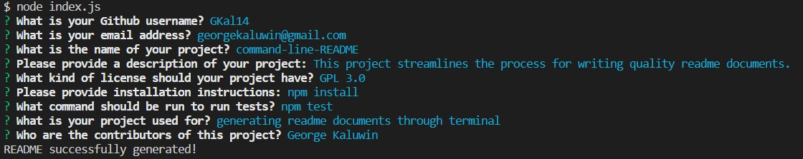

The purpose of this project was to create a README.md generator that can be implemented from the command line.

When the user has the code, they will install node modules through the command "npm install". 
the user can then use the command "node index.js" which will bring up the questions for the README file as shown below.

Once all questions have been answered by the user, their README.md file will be generated. 
The file sampleREADME.md in this repository is the corresponding document for the inputs shown in the screenshot above.

A walkthrough video of the process for generating a file using this application is available at the link below: 
https://drive.google.com/file/d/1GD01yb03j0flJ-_Nhn6zyf453WnjjRPH/view